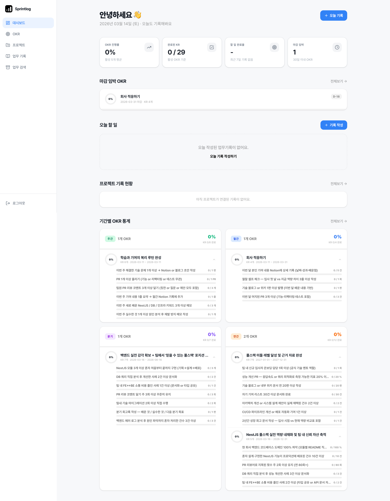
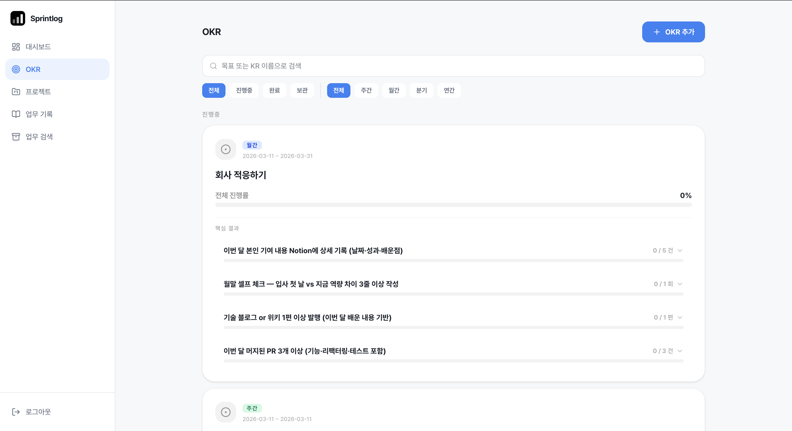
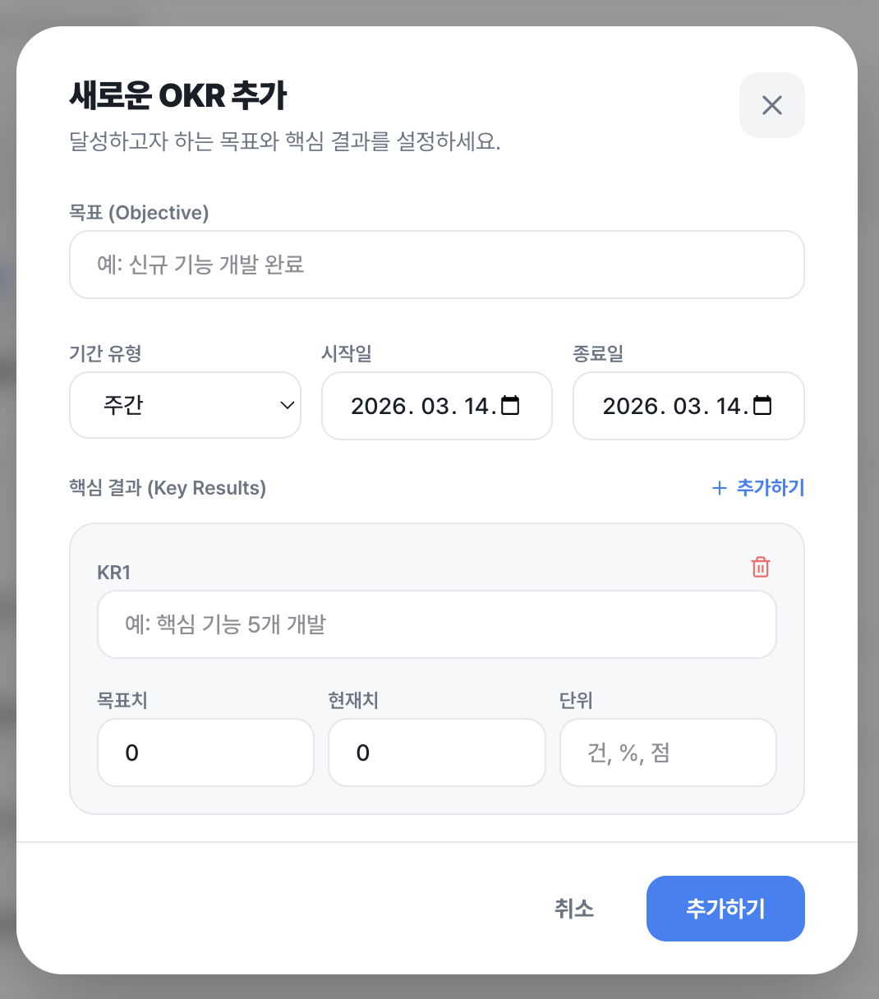
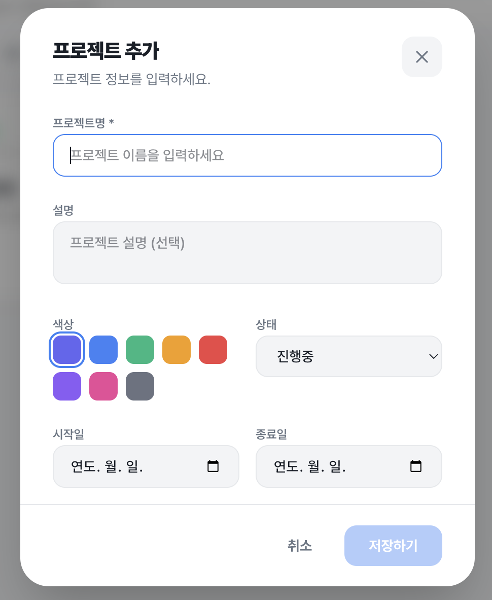
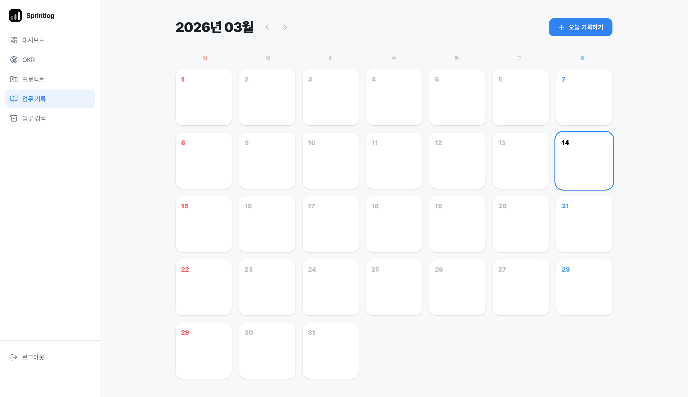
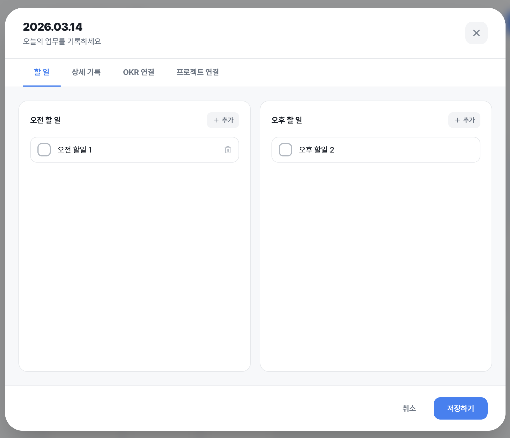
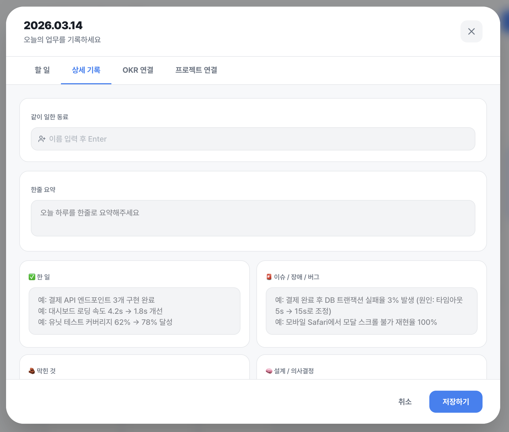
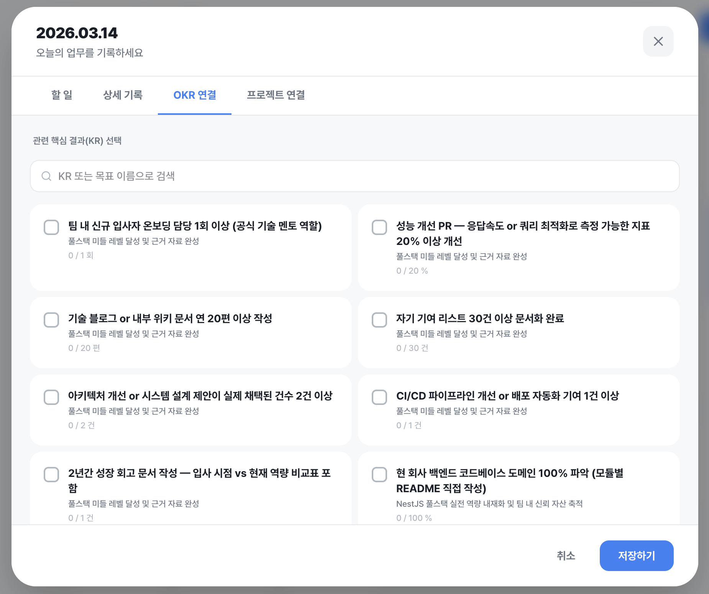
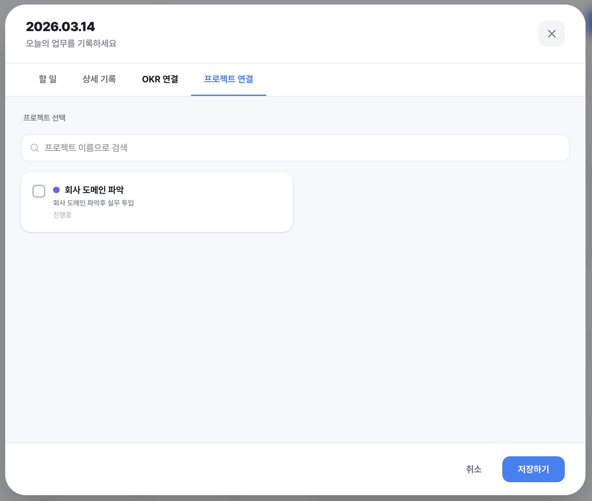
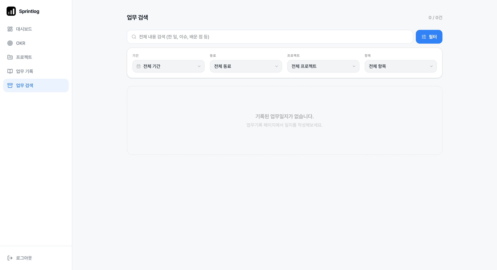

# Sprintlog

OKR 관리와 일일 업무기록을 한 곳에서 관리하는 서비스

## 주요 기능

### 대시보드

- OKR 진행률, 완료된 KR, 할 일 완료율, 마감 임박 OKR 통계 카드
- 마감 임박 OKR D-day 배지 + 도넛 차트 & KR 진행 바
- 최근 이슈/장애 목록 (클릭 시 해당 업무일지 오픈)
- 자주 함께 일한 동료 집계
- 프로젝트별 업무일지 활동 바 차트
- 오늘 업무기록 빠른 작성 버튼

### OKR 관리

- OKR 생성/수정/삭제, 기간 유형(스프린트·월간·분기·연간) 설정
- OKR당 핵심 결과(KR) 다수 등록 (목표값·현재값·단위)
- KR 클릭 시 연결된 업무일지 목록 확장 표시
- KR `current_value`는 연결된 업무일지 수로 자동 동기화
- 상태 필터 (진행중·완료·보관) + 이름 검색

### 프로젝트 관리

- 프로젝트 생성/수정/삭제, 색상·상태·기간 설정
- 상태(진행중·보류·완료·보관) 필터 + 이름 검색
- 프로젝트 카드에서 연결된 업무일지 목록 확장 표시

### 업무기록 캘린더

- 월간 캘린더 뷰 — 기록된 날짜는 파란색, 오늘은 링 표시
- 날짜 클릭으로 기록 작성/수정 모달 오픈
- 업무일지 삭제 기능

### 업무일지 모달

- **투두 리스트**: 오전/오후 구분, 완료 체크
- **상세 기록**: 한 일·이슈·막힌 것·설계·배운점·내일 할일·수치 변화·피드백·개선 포인트 (9개 필드) + 한줄 요약 + 같이 일한 동료 태그
- **OKR 연결**: 업무일지와 KR 다대다 연결 (검색 지원)
- **프로젝트 연결**: 업무일지와 프로젝트 다대다 연결 (검색 지원)
- 기록 삭제 기능 (헤더 휴지통 버튼 → 인라인 확인)

### 업무 검색 (아카이브)

- 전체 업무일지를 날짜·프로젝트·OKR·내용 필드 기준으로 검색/필터링
- 검색 결과 카드 클릭 시 해당 업무일지 모달 오픈

---

## 화면 미리보기

### 대시보드



### OKR 관리



### OKR 모달



### 프로젝트 모달



### 업무기록 캘린더



### 업무일지 모달 — 할 일



### 업무일지 모달 — 상세 기록



### 업무일지 모달 — OKR 연결



### 업무일지 모달 — 프로젝트 연결



### 업무 검색



---

## 기술 스택

| 분류        | 라이브러리                            |
| ----------- | ------------------------------------- |
| UI          | React 19, TypeScript, Tailwind CSS v4 |
| 라우팅      | React Router v7                       |
| 백엔드/인증 | Supabase (RLS, Auth)                  |
| 애니메이션  | Motion (motion/react)                 |
| 아이콘      | Lucide React                          |
| 날짜        | date-fns                              |
| 빌드        | Vite 7                                |
| 배포        | Vercel                                |

## 프로젝트 구조

```
src/
  components/
    Layout.tsx            # 사이드바, 모바일 헤더/하단 내비게이션, 공통 컴포넌트
  features/
    archive/
      ArchivePage.tsx     # 업무 검색 (전체 업무일지 필터/검색)
    auth/
      AuthPage.tsx        # 로그인 / 회원가입
    dashboard/
      DashboardPage.tsx   # 대시보드 (통계, OKR 차트, 이슈, 동료, 프로젝트 활동)
    logs/
      LogsPage.tsx        # 월간 캘린더 뷰
      WorkLogModal.tsx    # 업무일지 작성/수정 모달 (투두·상세·OKR·프로젝트 탭)
    okrs/
      OKRsPage.tsx        # OKR 목록 + KR 확장 패널
      OKRModal.tsx        # OKR 생성/수정 모달
    projects/
      ProjectsPage.tsx    # 프로젝트 목록 + 연결 업무일지 확장 패널
      ProjectModal.tsx    # 프로젝트 생성/수정 모달
  lib/
    api.ts                # Supabase API 함수
    supabase.ts           # Supabase 클라이언트
    cn.ts                 # className 유틸
  types.ts                # 공유 타입 (WorkLog, OKR, Project, KeyResult 등)
  App.tsx                 # 라우팅 + 전역 상태
```

## DB 스키마

```
profiles        — 사용자 프로필
okrs            — OKR (key_results: JSONB 배열로 KR 포함)
work_logs       — 날짜별 업무기록 (user_id + log_date unique)
todo_items      — 업무기록에 속한 투두 항목
work_log_krs    — 업무기록 ↔ KR 다대다 연결
```

모든 테이블에 Row Level Security(RLS) 적용 — 본인 데이터만 접근 가능.

## 시작하기

```bash
# 패키지 설치
pnpm install

# 환경 변수 설정
touch .env
VITE_SUPABASE_URL="URL"
VITE_SUPABASE_ANON_KEY="YOUR KEY"

# Supabase 스키마 적용
supabase-schema.sql 을 Supabase SQL Editor에서 실행

# 개발 서버 실행
pnpm dev
```

## 스크립트

```bash
pnpm dev          # 개발 서버 (HMR)
pnpm build        # 타입 체크 + 프로덕션 빌드
pnpm lint         # ESLint 검사
pnpm lint:fix     # ESLint 자동 수정
pnpm format       # Prettier 포맷
```
